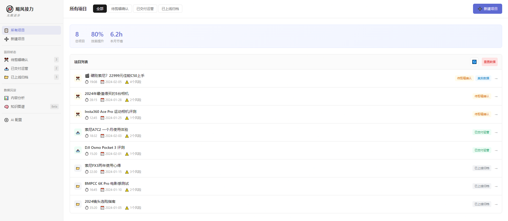
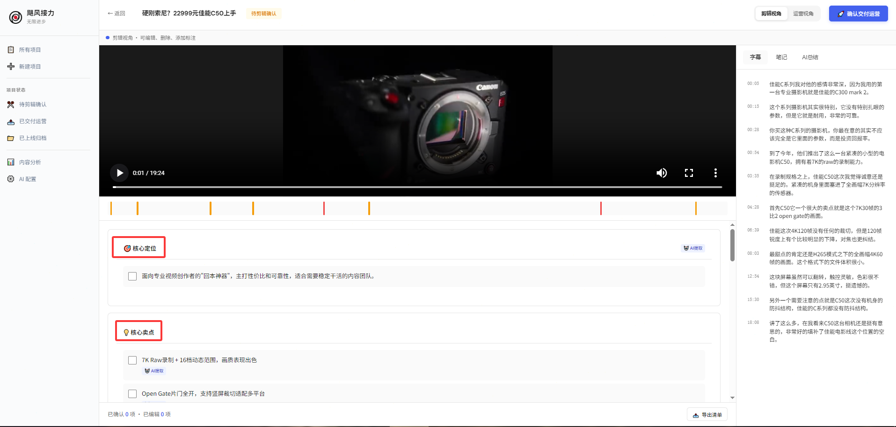
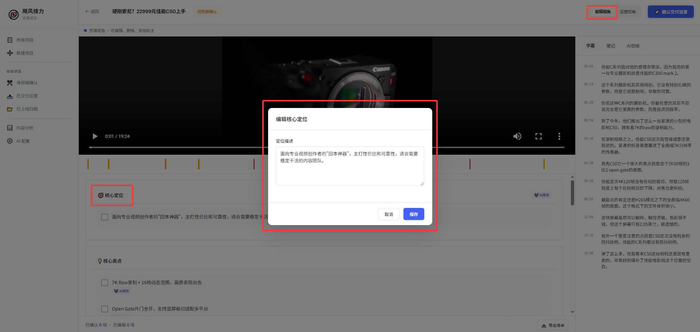
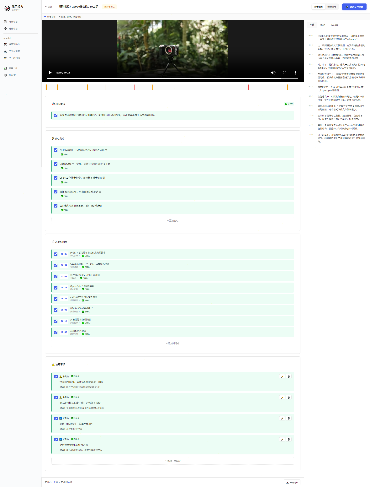

# 飓风接力 · StormRelay

<div align="center">


**内容生产的接力站 —— 无限进步**

透过"AI 生图"的表象，洞察到多人协作中的认知切换损耗。AI 不做代替，做翻译。

</div>

---

## 🎯 这是什么

**飓风接力**是面向专业内容团队的 **AI 认知翻译 + 自进化协作系统**。

一句话说清：**AI 把剪辑师脑子里的理解结构化输出，让运营和电商不用看完整视频就能抓住重点——同时团队经验自动沉淀为可进化的 Skill 体系。**

两条平行管线：

- **交付管线**：剪辑 → 运营（视频交接信息的结构化）
- **电商管线**：从同一视频中提取产品出镜片段，翻译为电商语言

### 思维迭代

这个项目是一次认知演进的产物：

1. **表象**：AI 能生成图文素材（PicCopilot、BrandRocket 都在做）——洞察够早，但停留在"缺素材 → 造素材"
2. **深层**：专业团队不缺素材，缺的是跨角色的认知传递——剪辑师脑子里的理解传不出去，不是态度问题，是大脑的认知模式切换成本
3. **转向**：AI 的角色从"代替"转为"翻译"——不替代任何人的思考，把创意语言翻译为运营语言、电商语言
4. **进化**：建立面向组织与未来的 Skill 自进化体系——团队经验自动沉淀，系统越用越准

### 核心洞察

一条频道视频完成后，它的信息要流向多个下游：频道运营写分发文案、电商编导做产品素材、市场营销规划投放策略。**每个角色需要的信息切片不同，但源头是同一个20分钟的视频。**

问题出在两头：

- **上游**：认知模式切换成本太高。剪辑师刚从创意模式（节奏、色彩、情绪）出来，切到文档模式写结构化信息很痛苦——不是态度问题，是大脑切换成本。
- **下游**：视频是线性锁死的信息容器——不能 Ctrl+F、不能筛选，每多一个下游角色就多一次完整的线性消费。

> **飞书能加字段吗？能。但容器不是瓶颈——填写成本才是。加了字段没人认真填，和没加一样。**

### 解决思路



AI 看视频写结构化草稿 → 剪辑师扫两分钟确认「对不对」→ 下游各取所需

不是让人不看视频——是**看之前先有张地图**，知道重点在哪。把上游的工作从「写」降级为「审」，把下游的工作从「盲看」变成「带着地图看」。

---

## ✨ 核心功能

### 1. AI 智能提取



基于火山引擎视频理解API（豆包大模型 Doubao-Seed-2.0-pro），自动提取：

- 🎯 **核心定位**：一句话概括视频的目标人群和价值主张
- 💡 **核心卖点**：3-5个关键卖点，带出品方标注（自研/合作/友商）
- ⏱️ **关键时间点**：适合截取短视频或封面的精彩片段
- ⚠️ **注意事项**：可能引发争议或需要说明的风险点

### 2. 剪辑视角 —— 2分钟确认



- ✅ 勾选确认 AI 提取的信息
- ✏️ 编辑修改不准确的内容
- ➕ 添加 AI 遗漏的要点
- 🚀 一键交付给运营

### 3. 运营视角 —— 3分钟上手



- 📋 结构化信息卡，一目了然
- 📝 添加运营笔记，记录分发策略
- 🤖 查看 AI 总结，快速理解视频
- 📁 标记上线归档

### 4. 电商视角 —— 平行管线


电商视角是独立于剪辑→运营交付链的**平行管线**，不依赖项目交付状态：

- 🛒 **产品出镜识别**：AI 自动识别视频中产品出镜片段，标注时间戳
- 🔄 **卖点翻译**：把「拍摄参数语言」翻译为「消费者语言」（如 "3M新雪丽棉" → "雪地生存100小时实测，穿暖了"）
- 💡 **拍摄建议**：基于当前素材质量给出下次拍摄的优化建议
- 📈 **电商价值评估**：预估可产出的详情页素材、短视频切片、小红书素材数量

### 5. 效率看板


从项目数据实时汇总：

- 🎯 **AI 标注采纳率**：OKR 核心指标（目标 ≥ 70%），从每条标注的状态字段计算
- 🛒 **电商素材产出**：跨项目的素材识别总量、确认量、涉及产品数
- 💡 **卖点关键词云**：从卖点和消费者语言中提取高频词
- ⚠️ **风险类型统计**：跨项目风险聚合

### 6. Skill 工作台（Beta）


AI 从团队实际操作中自动沉淀可复用打法：

- 🌳 **能力树**：底层通用 Skill → 中层场景 Skill → 表层任务 Skill
- 📐 **评判准则**：四条可编辑原则（能力进化、定时自省、反退化锁、能力树约束），决定什么能被沉淀
- 🤖 **AI 自省建议**：基于项目数据自动生成 Skill 管理建议
- 🔒 **人始终有控制权**：编辑、冻结、删除任何 Skill，导出到飞书

---

## 📊 效率预估（待验证）

| 环节         | 当前状态       | 使用工具后       | 核心逻辑             |
| ------------ | -------------- | ---------------- | -------------------- |
| 剪辑师交接   | 不填/敷衍两行  | AI草稿+2分钟确认 | 从「写」降级为「审」 |
| 运营理解视频 | 必须完整看一遍 | 先看地图再看视频 | 有方向 vs 盲看       |
| 电商素材提取 | 手动逐视频翻找 | AI 自动识别+翻译 | 素材利用率提升       |
| 跨角色追问   | 反复@问        | 结构化信息自查   | 信息在卡片里         |

> 以上为基于认知科学逻辑的预估，非实测数据。落地后首要任务是**用OKR埋点验证这些假设**。

---

## 🔄 双管线架构

```
                    ┌─────────────────────────────────────┐
                    │           AI 视频理解               │
                    │    (火山引擎 Doubao-Seed-2.0-pro)   │
                    └──────────┬──────────────┬───────────┘
                               │              │
                ┌──────────────▼──┐    ┌──────▼──────────────┐
                │   交付管线      │    │   电商管线（平行）   │
                │                 │    │                      │
                │ 剪辑视角        │    │ 产品出镜识别         │
                │   ↓ 确认交付    │    │ 卖点翻译             │
                │ 运营视角        │    │ 拍摄建议             │
                │   ↓ 归档上线    │    │ 电商价值评估         │
                └─────────────────┘    └──────────────────────┘
                                            │
                                   ┌────────▼────────┐
                                   │  Skill 自动沉淀  │
                                   │  (越用越准)       │
                                   └─────────────────┘
```

---

## 🛠️ 技术实现

### 文件结构

```
飓风接力/
├── index.html          # 项目列表页
├── project.html        # 项目详情页（三视角 + 电商平行管线）
├── upload.html         # 视频上传页
├── settings.html       # AI 配置页
├── analytics.html      # 效率看板（实时数据汇总）
├── knowledge.html      # Skill 工作台（Beta）
├── styles.css          # 共享样式
├── app.js              # 共享逻辑（数据管理 + 数据版本控制）
├── api/
│   ├── analyze.js      # 视频分析 API 代理
│   └── upload.js       # 文件上传 API 代理
├── icon/               # 图标资源
└── screenshots/        # README 截图（需手动截取）
```

### 技术栈

- **前端**：原生 HTML + CSS + JavaScript
- **风格**：Linear 风格，简洁专业
- **数据**：localStorage 本地持久化 + 数据版本控制
- **后端**：Vercel Serverless Functions
- **API**：火山引擎视频理解（豆包大模型 Doubao-Seed-2.0-pro）

### API 调用架构

```
前端 ──POST──→ /api/analyze ──转发──→ 火山引擎 Responses API
                  ↓
         Vercel Serverless Function
         （处理鉴权、转换格式、解析响应）
```

---

## 📐 OKR（如何度量效果）

| 目标             | 关键结果                 | 怎么量                               |
| ---------------- | ------------------------ | ------------------------------------ |
| AI草稿被认可     | 采纳率（确认+编辑）≥ 70% | 效率看板实时计算每条标注的状态比例   |
| 下游不用反复追问 | 运营追问频次降低 ≥ 50%   | 对比使用前后飞书消息追问条数         |
| 电商素材利用率   | 每期视频提取 ≥ 3 个素材  | 效率看板统计电商素材产出             |
| 人愿意主动用     | 首月主动使用率 ≥ 50%     | 通过工具交付的项目占比               |

---

## 🗺️ 迭代路线

| 阶段                  | 做什么                                                         | 验证什么                                     |
| --------------------- | -------------------------------------------------------------- | -------------------------------------------- |
| **Phase 1（MVP）**    | AI提取→剪辑师确认→运营消费                                     | "AI草稿+人确认"是否比纯人工填写更完整        |
| **Phase 2**           | 电商平行管线：产品出镜识别 + 卖点翻译 + 拍摄建议              | 电商素材利用率是否提升                       |
| **Phase 3**           | 迁入飞书生态（低代码轻应用/飞书机器人）                        | 嵌入现有工作流后采纳率是否更高               |
| **Phase 4（Beta）**   | Skill 自进化系统：能力树 + 评判准则 + AI 自省                  | 经验沉淀是否让系统越用越准                   |

---

## 💡 关于飞书

> 飞书多维表格加 AI 字段，技术上完全做得到。实际落地大概率就是飞书生态内的一个模块。
>
> 这个原型探索的不是「飞书做不到的事」，而是一个产品假设：**当 AI 替创作者完成认知模式切换后，交接信息的质量和完整度是否会显著提升？**
>
> 做什么比用什么做重要。洞察是核心，技术方案是可替换的。

---

## 🚀 快速开始

1. **访问网站**：打开部署的 Vercel 地址
2. **体验演示项目**：
   - 📹 **佳能C50深度评测**：完整的三视角交付流程演示
   - 🧊 **零下25度设备极寒测试**：电商视角 + STORMCREW 产品素材提取演示
3. **重置数据**：点击右上角"重置数据"按钮可恢复初始状态

### 测试 AI 分析功能

**测试视频：**

```
https://stormrelay-1335848641.cos.ap-guangzhou.myqcloud.com/硬刚索尼？22999元佳能C50上手 - 1.2025-12-04_佳能C50评测_3840x2160_V05_Bilib(Av115665734338931,P1) (1).mp4
```

> ⚠️ 此视频为从B站下载的影视飓风公开视频，经压缩后用于演示目的。如有不妥，请联系立即删除。

---

## 🎁 彩蛋

### HKRR 原则

在 AI 配置页的提示词模板中，植入了影视飓风的内容评判标准：

- **H**appiness（快乐）：利用幽默的开场白或轻松的语言风格
- **K**nowledge（知识）：传达核心信息、原理解析或实用方法
- **R**esonance（共鸣）：描述观众熟悉的场景或情感
- **R**hythm（节奏）：通过画面切换和剪辑速度保持注意力

---

## 📝 设计文档

完整的产品需求文档请查看：[PRD文档](stormbridge_demo_prd_f0695d64.plan.md)

---

<div align="center">

**飓风接力 · StormRelay**

_上游写不出来，下游看不过来。AI 做两头的翻译。_

📮 交流反馈欢迎 Issue

</div>
