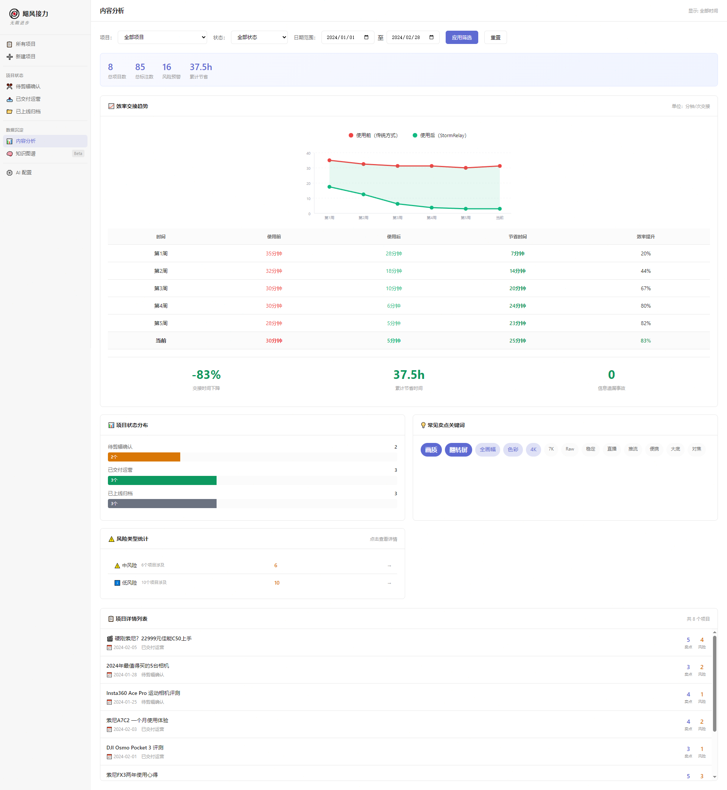
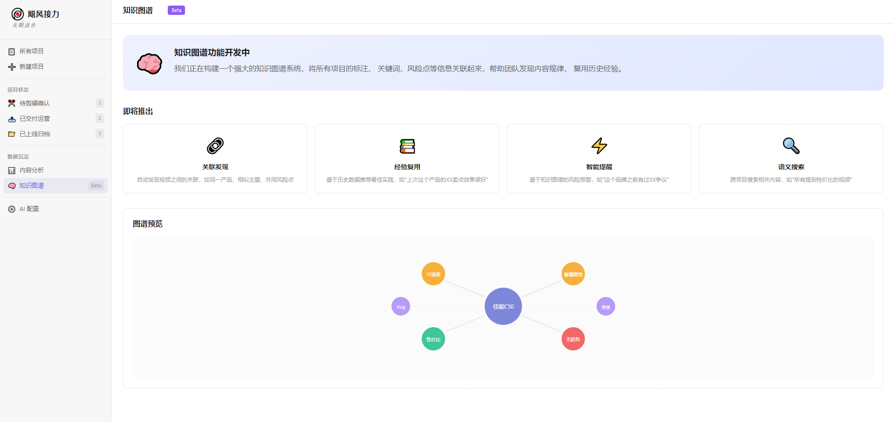

# 飓风接力 · StormRelay

<div align="center">


**内容生产的接力站 —— 无限进步**

交接时间从30分钟压到5分钟 · 关键信息从"靠记忆"变成"有清单" · 标注自动沉淀成可复用资产

</div>

---

## 🎯 这是什么

**飓风接力**是一个为内容团队设计的信息交接工具原型，专注解决「剪辑师 → 运营」的信息传递效率问题。

### 核心痛点

内容生产是一场接力赛：策划 → 编导 → 摄影 → 剪辑 → 运营。**每一次交接，都有信息丢失的风险。**

- 运营要看完20-40分钟视频才能抓到核心卖点
- 口头沟通容易遗漏关键信息和注意事项
- 没有结构化的交接清单，全靠记忆和追问

### 解决方案


**简洁直观的项目列表界面**，所有内容项目一目了然。AI提取视频核心信息 → 剪辑师勾选确认 → 运营3分钟上手。

---

## ✨ 核心功能

### 1. AI智能提取


基于火山引擎视频理解API，自动提取：
- 🎯 **核心定位**：一句话概括视频的目标人群和价值主张
- 💡 **核心卖点**：3-5个关键卖点，按重要性排序
- ⏱️ **关键时间点**：适合截取短视频或封面的精彩片段
- ⚠️ **注意事项**：可能引发争议或需要说明的风险点

### 2. 剪辑视角 —— 2分钟确认


剪辑师只需要：
- ✅ 勾选确认AI提取的信息
- ✏️ 编辑修改不准确的内容
- ➕ 添加AI遗漏的要点
- 🚀 一键交付给运营（2分钟完成）

### 3. 运营视角 —— 3分钟上手


运营收到项目后：
- 📋 结构化信息卡，一目了然
- 📝 添加运营笔记，记录分发策略
- 🤖 查看AI总结，快速理解视频（3分钟上手）
- 📁 标记上线归档

### 4. 效率数据看板



数据驱动效率提升：
- 📈 交接时间对比图（使用前 vs 使用后）
- 📊 项目状态分布统计
- 🏷️ 关键词热度分析
- ⚠️ 风险类型统计

### 5. 知识图谱（Beta）



发现项目之间的关联，让团队经验可以复用：
- 🔗 **关联发现**：自动发现相似项目，借鉴过往经验
- 📚 **经验复用**：关键词标签化，快速查找历史案例
- 🔍 **语义搜索**：自然语言搜索项目内容
- ⚡ **智能提醒**：根据新项目自动推荐相关内容

---

## 📊 效率提升数据

| 环节 | 没有工具 | 有工具 | 效率提升 |
|------|----------|--------|----------|
| 剪辑师写交接信息 | 10-15分钟 | 2分钟 | **80%+** |
| 运营理解视频内容 | 20-40分钟 | 3分钟 | **85%+** |
| 来回追问沟通 | 5-10分钟 | 接近0 | **90%+** |
| **总计** | **30-60分钟** | **5分钟** | **80%+** |

---

## 🎬 功能演示

### 状态流转演示

<!-- 
[应插GIF] 状态流转动图
展示：项目从"待剪辑确认"→"已交付运营"→"已上线归档"的完整流程
-->

```
待剪辑确认 ──确认交付──→ 已交付运营 ──标记上线──→ 已上线归档
     ↑                        ↑                        ↑
   剪辑可编辑              剪辑只读+可撤回           双方只读+可撤回
```

### CRUD操作演示

<!-- 
[应插GIF] 标注编辑动图
展示：添加卖点、编辑内容、删除项目的交互
-->

### 视频播放与字幕同步

<!-- 
[应插GIF] 视频播放动图
展示：点击字幕跳转到对应时间点
-->

---

## 🛠️ 技术实现

### 文件结构

```
飓风接力/
├── index.html          # 项目列表页
├── project.html        # 项目详情页
├── upload.html         # 视频上传页
├── settings.html       # AI配置页
├── analytics.html      # 内容分析页
├── knowledge.html      # 知识图谱页（Beta）
├── styles.css          # 共享样式
├── app.js              # 共享逻辑（数据管理）
├── icon/               # 图标资源
│   └── 影视飓风.png
└── [视频文件].mp4      # 演示视频
```

### 技术栈

- **前端**：原生HTML + CSS + JavaScript
- **风格**：Linear风格，简洁专业
- **数据**：localStorage本地持久化
- **API**：火山引擎视频理解（豆包大模型）

---

## 🎁 彩蛋

### HKRR原则

在AI配置页的提示词模板中，植入了影视飓风的内容评判标准：

- **H**ook（钩子）：开头3秒是否足够吸引人？
- **K**nowledge（干货）：是否提供了独特、有价值的信息？
- **R**esonance（共鸣）：是否触动了观众的情感或痛点？
- **R**etention（留存）：是否有让人想回看或分享的内容？

---

## 🚀 快速开始

### 🌐 在线体验（推荐）

**点击访问在线部署版本**：[https://stormrelay.vercel.app/](https://stormrelay.vercel.app/)

无需下载，直接在浏览器中体验完整功能。

### 💻 本地运行

1. **下载项目**：克隆或下载本仓库
2. **打开首页**：用浏览器打开 `index.html`
3. **体验演示**：点击"佳能C50深度评测"项目，体验完整流程
4. **重置数据**：点击右上角"重置数据"按钮可恢复初始状态

### 配置API（可选）

如需使用真实AI分析功能：

1. 前往 [火山引擎控制台](https://console.volcengine.com/ark) 获取API Key
2. 打开 `settings.html` → API配置
3. 输入API Key并保存

---

## 📝 设计文档

完整的产品需求文档请查看：[PRD文档](stormbridge_demo_prd_f0695d64.plan.md)

---

## 🙏 致谢

灵感来源于内容创作团队的协作场景，致敬所有在效率工具领域持续探索的创作者。

HKRR原则和"无限进步"理念给了我很大启发。

**好的工具应该让人更专注于创造，而不是被流程消耗。**

---

<div align="center">

**飓风接力 · StormRelay**

*让每一次交接都有记录，让团队的内容经验不断沉淀*

📮 交流反馈欢迎 Issue

</div>
